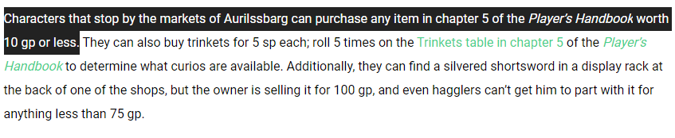

And I have a terrible time getting this onto paper and setting goals for my personal projects. I'm hoping by writing it down here I can frame what I want the app to do.

### What kind of app do I want to make?
At a high level the app will allow a DM to prepare the inventory of the different mercantile establishments based on the published source material. 

Most campaigns in DnD will have the players eventually visit a market or some other type of store within their setting. The DMs guide usually will state that the store will sell anything from the Equipment Section of the Players Handbook under X value in GP. 

This isn't particularly useful as the list in the PHB is very long and isn't sortable (being paper for the physical books and just a table in digital form). 

### What do I want the app to do

Let's write a user story... kinda

As a DM:

- I should have a way to filter the PHB equipment list to specify the min/max GP value of items that are available in a store.
- I should be able to provide a link to players to view a non editable and printable final list
- I should have the ability to modify the pricing of items based on a multiplier, e.g. equipment list < 50GP * 10
- I should be able to filter by equipment type (Weapons could be at a blacksmith, magic components at an apothecary)
- I should be able to filter by source book, there are many items in the new adventures that may need to be included.

**Optional non user story extras**
- Lightning fast however possible, should load really really really fast. Additionally dev experience should be fast too! This is optional for now but I really like the idea of trying to optimize a webapp as much as possible.

- The printed list should look like a player handout similar to https://homebrewery.naturalcrit.com/

- Expand the tool to include rolls on the trinkets table.

### How do I make it
This is an easy enough choice for me, I want the resulting lists to be sharable via a link and I'm a full-stack engineer. I'll make it a react app bootstrap’d by `create-react-app`. I'll probably eject it at some stage and may look at using something other than webpack as the bundler.

### Where will it live?
I've been using Netlify for the better part of a year and see no reason to stop. Their free tier has everything I need.

I think I have enough to start putting together a skeleton app. Once I start writing some code I'll have a better idea of what takes priority.

